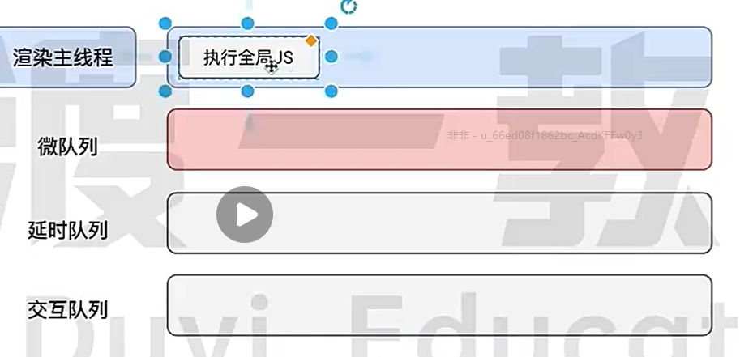

# 2024面试准备

## Promise
> Promise的核心是then方法的实现 调用then方法返回一个Promise并且向callback中添加一个任务

[MyPromise.js](./%E8%80%83%E7%82%B9%E6%B8%85%E5%8D%95.md)

 
## 事件循环机制

> 所有的任务都在渲染主线程执行， 任务没有优先级之分，但是消息队列有优先级 微任务 > 渲染任务 > 交互任务 > 宏任务。 主线程会根据优先级从不同的消息队列中取出一个任务放入渲染主线程等待执行。



## 性能优化问题
- 编译性能问题
  - 使用缓存
  - 不指定模块编译
- 运行性能
  - 网络问题 Tree shaking 分包 CDN加速 异步加载
  - 代码执行效率低 Performance选项卡排查 分析事件空间复杂度
  - 任务集中执行 分片执行 调度任务优先级
## Webpack构建流程
1. 合并config配置得到最终的配置对象
2. 根据配置初始化compiler对象，注册插件，执行run开始编译
3. 从入口开始根据依赖递归构建AST
4. 根据loader处理文件，形成每个模块的依赖关系
5. 将模块根据依赖关系打包成bundle文件 最终输入文件
## Script defer async 
- async 异步加载，加载完立刻执行
- defer 异步加载，加载完且HTML解析完毕后执行
## 浏览器渲染原理（从地址栏输入url到渲染发生了什么）
   1. 解析地址信息，是文件路径，base64，关键字，还是URL
   2. DNS解析
    - 读取本地etc文件
    - 读取本地DNS缓存
    - 发送DNS请求，查询IP地址
   3. 建立TCP链接
      1. 进行三次握手
   4. 解析HTML
      1. 构建DOM tree
      2. 解析并构建CSS tree
      3. 解析执行JS
   5. 布局
      1. 生成渲染树
      2. 计算布局 根据渲染树计算元素的在窗口的位置大小
   6. 绘制
      1. 绘制元素图层 将渲染树的每个元素绘制成像素点
      2. 合并图层（z-index， 3D转换）最终形成看的页面
## 重排和重绘
   - 重排（reflow 回流）消耗性能，会导致重新布局
      - 增加，删除DOM
      - 修改元素的几何属性（大小，位置，边框）
      -  getBoundingClientRect()
   - 重绘 轻量级操作
     - 修改背景颜色
   - 优化建议
     - 合并DOM操作
     - 批量修改样式
     - transform不会进行重排，通过GPU加速来执行的
## Proxy和Reflect
[Proxy Api](./Proxy%26Refect.js)

## React是如何更新组件的

## React合成事件

## React中的Diff算法

## Vite和Webpack的差异
- Webpack先编译再启动
- Vite先启动根据请求异步编译

## Redux工作原理
它就是一个存储的状态的容器，组件可以从该容器中作为 props 接收数据。通过触发Action触发更新数据的操作，单向数据流的设计理念。Reducer会根据Action返回一个新的状态，然后触发订阅组件的重新渲染。

## 资源加载监听

`Performance` API

## 监听DOM树变化

`MutationObserver` API

## 如何防止爬虫

- robot.txt 防止搜索引擎爬取
- User-Agent 防止脚本爬取（Node Puppeteer）
- 访问统计分析
- 行为验证码

## 网站安全

# CSRF 跨站请求伪造
> A登录了`www.xxx.com`网站，黑客使用一些方法诱骗你进入恶意网站。在恶意网站内调用B的一些`www.xxx.com/user?id=1`的接口，由于A已经登录过，Cookie会被自动带入。

```HTML
// 直接发送GET请求

```

```HTML
// POST请求
<Form action="www.xxx.com/user?id=1" id="form">
</Form>

<script>
  // 自动提交
  document.querySelector('#form').submit()
</script>
```
### 防护手段
对于非跨域站点

设置`Samesite:strict`禁止跨站携带cookie

对于跨站站点

- 服务器设置referer白名单检查头，确保来源和目标都合法。
- 请求头添加一个token 浏览器会自动携带cookie但是不会自动添加Head，需要在js内手动添加
  
## CORS 同源策略

> 端口，协议，域名三者相同

## XSS注入攻击
> 输入一些傻逼代码字符上传到服务器
把特俗符号转成unicode编码

## http和SSL证书
1. 服务器向浏览器发送SSL证书
2. 浏览器验证证书
3. 浏览器再生成一个对称密钥，发送给服务器
4. 服务器用私钥解密对称密钥
5. 后续传输的数据都用该对称密钥进行加解密传输

## prototype和__proto__

> 只有函数/构造函数才有prototype属性 该属性指向其原型对象， 处了undefind和null外其他类型对象都具有__proto__属性，__proto__指向其构造函数的prototype。

实例对象.__proto__ === 构造函数的prototype === 原型对象

**所有对象的`__proto__`最终指向`null`;**

```js
function Person(){}
const zhangSan = new Person();

zhangSan.__proto__ === Person.prototype
```
### new Fn()背后做了什么？

```js
function Fn(...args) {
  const obj = {}
  obj.__proto__ = Fn.prototype;
  Fn.call(obj, args);
  return obj;
} 
```
## CommonJs和ESM

- CJS

  CJS的核心就是require函数
  ```ts
  function require(modulePath: string){
    const moduleId = generateModuleId(modulePath);
    if(moduleCache[moduleId]){
      return moduleCache[moduleId]
    }
    function _require(exports, module, require){
      // 把文件代码丢到这里来执行
    }
    const module = {
      exports: {}
    }
    const exports = module.exports;
    _require.call(exports, exports, module, require);
    moduleCache[moduleId] = module.exports;
    return module.exports;
  }
  ```
得出结论`this`,`exports`,`module.exports`在最开始的时候是完全相等的

```js
this === exports // true
module.exports === exports // true
```
- ESM
ESM对导入对象的引入，只能读取不可以修改。可以异步加载，支持动态导入。

**CMJ不支持 tree shaking**

## React 工作流程

- render阶段（可打断）
  - 调度任务
  - 协调生成fiber（diff算法）
- commit阶段（不可打断）
  - 生成DOM
  
## Webpack Vite优化手段

- 打包缓存
- include exclude 排除非必要打包文件
- 热模块更新HMR

## Webpack HMR原理

> 默认情况下当模块变动时浏览器会调用reload事件重新加载
> 当开启HMR时会进行一下流程

1. dev Server会启动一个socket
2. 模块变动时dev server通过socket通知浏览器哪个模块发生了变动
```json
{
  "h":"xxxxxxxxxx"
}
```
3. 浏览器请求该模块最新的代码
4. hotMoudleReplacementPlugin将新代码替换掉旧代码
5. 重新执行index.js
  
## 手写call，apply

```js
Function.prototype.myCall = function(ctx, ...args){
  // fn.call(,1,2) fn.call(null,1,2) 第一个参数可以不传 不传时this 指向全局
  // 使用Object(ctx)是因为传入原始值时让this指向其构造函数
  // fn.call(1,1,2) 传的1，要指向Number对象
  ctx = ctx === null || ctx === undefind ? globalThis : Object(ctx);

  // 获取到函数
  const fn = this;
  // 将fn的this指向ctx 如果要考虑ctx中可能也有fn属性，避免被覆盖可以使用Symbol
  ctx.fn = fn;
  const result = ctx.fn(args);
  return result;
}
```

### Vue虚拟DOM和React的虚拟DOM

- React推崇单向数据流每次更新都会生成一个新的Fiber Tree 通过Diff算法至上而下寻找最小的更新范围
- Vue使用双向绑定，基于模块编译出虚拟DOM Tree 当发生更新时，Vue根据依赖追信息精确踪到所需更新的部分，然后生成新的虚拟DOM patch到真实DOM

## React路由实现原理
基于浏览器的history和hash api实现
- 监听URL变化
- 根据路径匹配对应的路由
- 渲染对应的组件